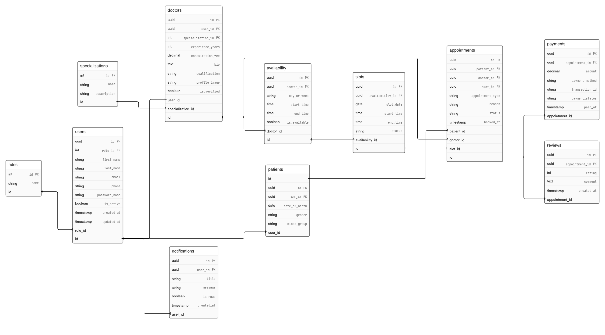

# Schedula Backend

## Overview

Schedula is a Doctor Management System backend built with NestJS, TypeScript, and PostgreSQL.

This repository contains the initial backend project setup and the ER Diagram created based on the provided wireframe.

## Tech Stack

- NestJS
- TypeScript
- PostgreSQL
- Postman

## Day 1 Deliverables

-  NestJS Project Setup
-  ER Diagram

## Project Structure

```
src/
docs/
test/
```

## ER Diagram

The following Entity Relationship Diagram (ERD) represents the initial database design for the Doctor Management System based on the provided wireframe.



## Installation

```bash
npm install
```

## Run

```bash
npm run start:dev

```
## Notes

Initial backend project setup completed for Day 1.

## Author

Jitandar Kumar